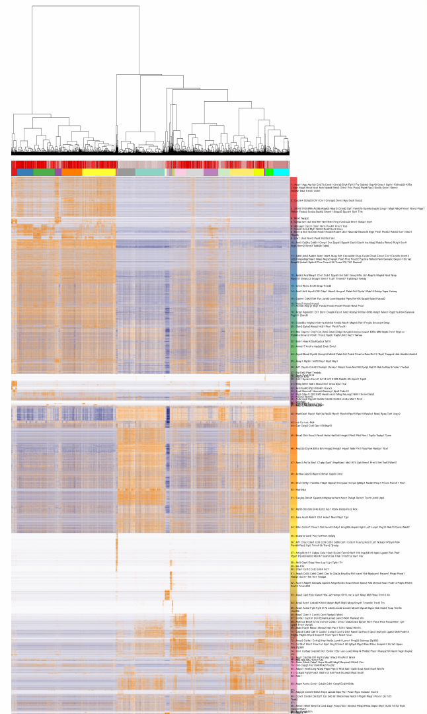

# Antler

Antler is an **in-development** R package containing a set of methods used to analyse single-cell RNA-seq experiments. 

The easiest way to install Antler is to use the devtools package.

``` r
devtools::github_install("juliendelile/Antler")
```

### Unbiased Gene Modules Identification  

The most useful method currently available identifies genes demonstrating concerted patterns of expression. Briefly, the algorithm select the genes that show enough Spearman correlation with at least a certain number of other genes. The genes are then iteratively grouped and filtered with criteria assessing some features of the patterns. The iterative loop terminates when the number of gene modules converges, i.e. when no gene module is excluded at the last iteration.  
 
Below is an example of unbiased gene module identification performed on about 40k cells dissected from the cervicothoracic region of developing mouse embryos. The dataset needs to be downloaded as explained [here](https://github.com/juliendelile/MouseSpinalCordAtlas#data-availability). For this dataset, **running the script requires about 110 GB of RAM**.

``` r
library(Antler)
```

The principal structure of the package is a Reference Class object.
``` r
m = Antler$new(plot_folder="/path/to/any/existing/directory/for/plots/")
```

The dataset folder must contain a read count file named "assayData.csv" and a meta-data file named "phenoData.csv" with at least 3 fields: "timepoint" (floating values), "replicate_id" (integer values) and "treatment" (characters). 
``` r
m$loadDataset(folderpath="/path/to/dataset/directory")
```

We deduce the gene names for their Ensembl IDs.
``` r
m$setCurrentGeneNames(geneID_mapping_file=system.file("extdata", "Annotations/biomart_ensemblid_genename_mmusculus.csv", package="Antler"))
```

Remove outliers genes and cells
``` r
m$removeOutliers( genesmin = 500,       # cells need at least 500 expressed genes
                  cellmin = 20,         # genes need to be expressed in at least 20 cells
                  data_status = 'Raw')
```

Select dispersed genes from normalized gene levels
``` r
m$normalize('geometric_mean_sizeFactors')
dispersed_genes = m$dispersedGenes(zscore_threshold=-.5, data_status='Normalized')
m$filterGenes(dispersed_genes)
```

Identify gene modules
``` r
# Runtime about 10 min.
m$identifyGeneModules(
        method="TopCorr_DR",
        corr_t = 0.3, # the Spearman correlation treshold
        topcorr_corr_min = 3, # minimum number of genes a gene should be correlated with
        topcorr_mod_min_cell = 0, # minimum number of cells with "positive" binarized level per gene module
        topcorr_mod_consistency_thres = 0.3, # ratio of expressed genes among "positive" cells per gene module
        data_status='Raw'
        )
```

Export gene modules to file
``` r
m$writeGeneModules(basename="UnbiasedGMs", gms='topCorr_DR.genemodules')
```

Perform hierarchical clustering of the cells, using the selected gene modules.
``` r
m$identifyCellClusters(method='hclust', used_genes="topCorr_DR.genemodules", numclusters=25, data_status='Normalized')
```

Save a heatmap showing the clustered cells over the identified gene modules
``` r
# We will display only a subset of the identified genes by intersecting them with a GO term-based selection
# GO:0007399 "nervous system development"
# GO:0030154 "cell differentiation"
# GO:0016477 "cell migration"
displayed_genes = getGenesFromGOterms(c('GO:0007399', 'GO:0030154', 'GO:0016477'))
m$plotGeneModules(basename='UnbiasedGMs',
                  displayed.gms = c('topCorr_DR.genemodules'),
                  displayed.geneset=displayed_genes,
                  use.dendrogram='hclust',
                  display.clusters='hclust',
                  display.legend=F,
                  file_settings=list(list(type='pdf', width=25, height=35)),
                  data_status=c('Normalized'),
                  gene_transformations='logscaled',
                  pretty.params=list("size_factor"=8, "ngenes_per_lines" = 15, "side.height.fraction"=.1),
                  )
```

<a href="./inst/examples/UnbiasedGMs_topCorr_DR.genemodules_Normalized_logscaled.pdf">Download PDF with high resolution image (78.5 MB, powerful pdf viewer recommanded, e.g. mupdf)</a>

<p align="center"></p>

