```{r, echo = FALSE}
embed_png <- function(path, dpi = NULL) {
  meta <- attr(png::readPNG(path, native = TRUE, info = TRUE), "info")
  if (!is.null(dpi)) meta$dpi <- rep(dpi, 2)
  knitr::asis_output(paste0(
    ""
  ))
}
pdf_to_png <- function(pdf_file) {
  if (.Platform$OS.type == "unix") {
    system2(
      command = "convert",
      args = paste(
        "-density 200",
        pdf_file,
        sub("\\.pdf", "\\.png", pdf_file)))
  } else {
    stop("Vignette generated only on unix. Todo: add command for windows if needed.")
  }
}
pdf_to_png_to_images <- function(pdf_file) {
  pdf_to_png(pdf_file)
  file.copy(sub("\\.pdf", "\\.png", pdf_file), "./images/")
}
knitr::opts_chunk$set(comment = "#>", collapse = TRUE)
# knitr::opts_chunk$set(eval=FALSE)
```

```{r results="asis", echo=FALSE}
# directly adding css to output html without ruining css style https://stackoverflow.com/questions/29291633/adding-custom-css-tags-to-an-rmarkdown-html-document
cat("<style> img {border: 0px;outline: 0;padding: 10px;}</style>")
```

In this vignette, we will demonstrate how **Antler** can be used to build the lineage tree of a cell population differentiating over time and infer the pseudotime dynamics of gene expression.

<p align="center">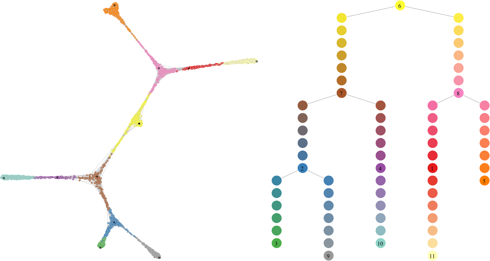</p>

## Unbiased reconstruction of the differentiating cell trajectories

Schematically building a cell state lineage tree from a scRNA-seq dataset consists in:

1. Evaluating the similarity between the cells based on their transcriptomic profiles.

2. Connecting cells with their most similar neighbors using a graph or a tree structure. This assumes *maximum-parsimony*, i.e. that cells progress through differentiation with minimal changes in their transcriptomic profiles.

From there, path-finding strategies can be employed to identify the different branches of the cell state lineage. These cells' orderings are then rescaled using the cells' sampling time to define a pseudo-temporal non-linear axis onto which the dynamics of gene expression is projected. Branching lineages also require the characterization of the bifurcation points along the trajectories.

### A dimension reduction problem

When working with dataset capturing the whole transcriptome, the main challenge is that not all the transcriptomic features respect the *maximum-parsimony* principle mentionned above. Indeed, many genes support biological functions which are not directly related to the differentiation process (cell cycle, metabolism...). In a cell population, these genes does not demonstrate synchronous transitions along a differentiation branch.

The objective is to mitigate the effect of these genes on the way cell-cell similarity is evaluated. Multiple strategies are possible.

One approach is to use expert knowledge and manually select the genes known to be involved in the differentiation process. This strategy will increasingly prevale as more knowledge is being gathered on the gene network responsible for differentation processes. Yet for now, it may also preclude the discovery of new transitions involving genes which have not yet been characterized so a fully unbiased and data-driven strategy should be preferred.

Another approach is to use a dimension reduction technique (e.g. PCA, t-SNE, UMAP) and presume that the signal projected in the lower dimensional space corresponds to the sought differentiation-related states. Two related inconveniences are that nothing guarantees that transcriptomic features unrelated to differentiation do contribute to the projection map, and often these techniques operate as black-boxes which do not explain what features are important factors to the projections.

A third simple approach is to select genes that are sufficiently correlated with the samples' time of acquisition (sample time). These genes are probably involved in the differentiation process as they would synchronously increase or decrease as time advances. The caveat is that time is linear and many differentiation-related genes would have a transient expression and/or would solely be expressed in subsets of the dataset, so time-correlated selection would be missing many important genes. This issue is amplified as larger datasets covering longer periods of time are processed.

In appearance, the gene selection step seems to face a chicken and egg situation where:

* having the differentiation tree is necessary to select the differentiation-related set of genes as this is the only way to validate that a gene is an interesting candidate for playing a role in differentation.
* having the differentiation-related set of genes is necessary to build the differentiation tree as these genes should be used to define the cell-cell similarity measure.

### Antler's approach

Because selecting the differentiation-related set of genes and building the differentiation tree are equivalent tasks and can't be treated sequentially, **Antler** opts for a solution that evaluates a candidate set of genes by measuring some properties of their associated differentiation tree.

The search is treated as an optimization problem consisting in: 

1. Pairing a numeric weight to each gene of the dataset, these weights adjusting the contribution of each gene in the cell-cell similarity matrix used to build the differentiation tree.

2. Finding the set of weights minimizing a property of the differentiation tree. Three metric can be specified:

    * the `timecorr` metric is the correlation between the cells' actual sample time and the pseudotime calculated on the tree. This is the recommended option for multiple timepoint datasets containing cells progressing synchronously along their differentation trajectories (e.g. embryonic development, many *in vitro* differentiation protocol). This metric is not applicable in the case of asynchronous differentiation where multiple consecutive stages coexist (e.g. adult stem cells dataset with quiescent and terminally differentiated cells in the same collected timepoint).
    * the `smoothness` metric favors genes having a smooth patterns of expression along the branches of the differentiation tree (increasing or decreasing regularly), in contrast with the ones having salt-and-pepper-like expression along the different trajectories. 
    * the `complexity` metric counts how many leaves the differentiation tree has.

The optimization engine can be set to either simulated annealing (using one of the metric as objective function) or a multi-objective evolutionary algorithm (NSGA-II).

<p align="center">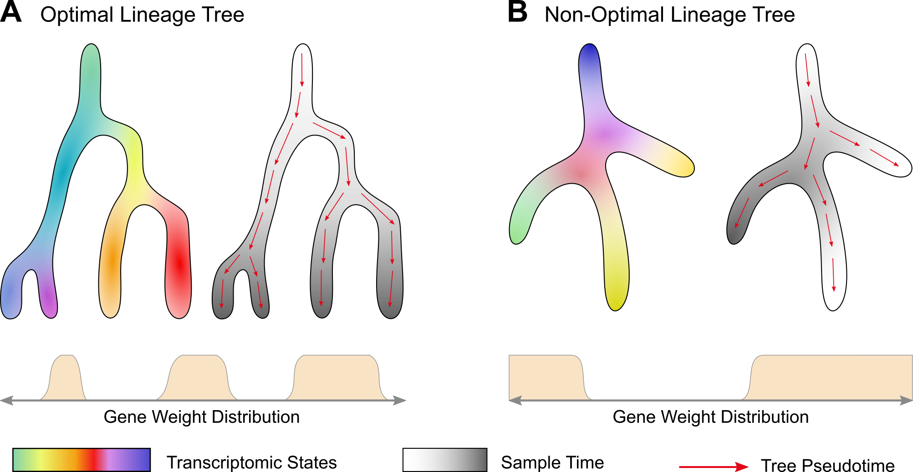</p>
<p align="center"><i>Illustration of the pairing between lineage trees and gene weight distruations. (A) In the optimal case, the sample time (greyscale) and the pseudotime calculated on the tree (red arrows) progress in a correlated manner. (B) In a non-optimal case, the correlation is low. Gene weight distribution schematics illustrate that for each distribution a different lineage tree is obtained. The transcriptomic state colors are drawn randomly and are not supposed to match in both cases.</i></p><br>

In order to reduce the number of parameters to optimize, we take advantage of the transcriptomic summary approach. The optimization will run at the transciptomic feature level instead of the gene level. Each gene will then receive the weight of its associated gene module.

### Idealized synthetic dataset

In this vignette, we will reconstruct the lineage tree of a synthetic dataset designed to highlight the key benefits of the method. The dataset is created with [Sledge](https://github.com/juliendelile/Sledge), a Python module generating branching differentation dynamics mixed with independet linear and cyclic transcriptomic features.

<p align="center"></p>
<p align="center"><i>The synthetic dataset is build upon 4 sets of gene modules: the first set is associated with the bifurcating cell lineage (19 states/modules), the second set is related to a simpler process with three linear transitions (4 states/modules), the third is mapped to a cycling set of 4 states (e.g cell cycle phases), and the fourth to a group of unexpressed genes. The asterisk relates how gene expression is represented on the heatmap (module 3, left) and along the differentation tree (level indicated in green, right).</i></p>

## Transcriptomic summary

We start by identifying the gene modules and visualizing the transcriptomic summary following a pipeline similar to the one described in the [transcriptomic summary vignette](https://juliendelile.github.io/Antler/articles/Transcriptomic-summary.html).

```{r, results = "hide", message=FALSE, warning=FALSE}
library(Antler)

antler <- Antler$new(output_folder = "/tmp/demo_carvings/")

antler$load_dataset(
  folder_path  = system.file(
    "extdata",
    "synthetic_lineage",
    package    = "Antler"))

antler$normalize('CPM')

antler$gene_modules$identify(
  name                  = "unbiased_gms",
  corr_t                = 0.15,
  corr_min              = 3,
  mod_min_cell          = 0,
  mod_consistency_thres = 0.4)

antler$cell_clusters$identify(
  name               = "hclust",
  gene_modules_name  = "unbiased_gms")

antler$add_color_map(name = "timepoint", content = brew_more_colors(seq(5), "YlOrRd"))
antler$add_color_map(name = "lin_state", content = brew_more_colors(seq(19)-1, "Set3"))
antler$add_color_map(name = "lon_state", content = brew_more_colors(seq(4)-1, "Set2"))
antler$add_color_map(name = "cc_state", content = brew_more_colors(seq(4)-1, "Set1"))

antler$plot_transcriptome_summary(
  gene_modules_name  = "unbiased_gms",
  cell_clusters_name = "hclust",
  cell_side_colors   = c(
    'timepoint', 'hclust', "lin_state", "lon_state", "cc_state"),
  cell_side_colors_hide_legend = "hclust",
  data_status        = "Normalized",
  gene_level_func    = "logscaled",
  file_settings      = list(list(type='pdf', width=8, height=8)),
  fontsize           = 6,
  color_limit_value  = 2.0,
  gene_labels        = grep("g0*[1-3]$", antler$gene_names(), value=T))
```

```{r, echo = FALSE, results = "hide", message=FALSE, warning=FALSE}
pdf_to_png_to_images("/tmp/demo_carvings/Transcriptome_summary_unbiased_gms_hclust_Normalized_logscaled.pdf")
```
<p align="center"></p>
<p align="center"><i>Transcriptomic summary of the synthetic dataset.</i></p><br>

The pipeline identified 41 gene modules storing the genes related to 1. cell differentation (lin... genes), 2. a linear transition (lon... genes), 3. cell cycles (cc... genes) and removed all the unexpressed genes. If the number of gene modules is too large, it is often worth specifying a lower a priori number in order to reduce the computational complexity of the following optimization (`num_final_gms` argument).

We now aim at automatically selecting the gene modules related to differentation and building a cell state graph relating the cells in that manifold.

## Carving the cell trajectories

The `antler$carve()` function builds the cell state graph from which the differentiation tree will be reconstructed in the next section. The graph is obtained with the following steps:

1. Finding the set of gene module weights minimizing some properties of the associated cluster-level minimum spanning trees (cMST). Two optimization algorithms are available: simulated annealing by default or genetic algorithm. 
2. Calculating the cell similarity matrix based on the weighted euclidean distance of the (z-scored log-transformed) normalized gene levels.
3. Building a k-nearest neighbors graph from the similarity matrix.

The graph is projecting onto 2 dimension for plotting purposes only and community detection is performed for the pseudotime reconstruction (next section). 

### Optimization with Simulating Annealing

Simulating annealing optimizes a single objective which should be the correlation between sample time and pseudotime on the cMSTs (`optim_objectives` argument set to `"timecorr"`). Before running the optimization the complexity of the dataset is reduced by:

1. Averaging the z-scored log-scaled normalized gene level per gene modules,
2. Clustering the cells with an iterative hierchical clustering algorithm producing similar-sized clusters (via the `cluster_size_limit` and `cluster_size_limit_ratio` arguments),
3. Averaging the gene module averages per clusters.

```{r, echo=FALSE, results = "hide", message=FALSE, warning=FALSE}
antler$carve(
  gene_modules_name          = "unbiased_gms",
  optim_strategy             = "SA",
  cell_colors                = c(
    'timepoint', 'lin_state', 'lon_state', 'cc_state'),
  optim_objectives           = "timecorr",
  clustering_timepoint_first = TRUE)
```

```{r, echo = FALSE, results = "hide", message=FALSE, warning=FALSE}
pdf_to_png_to_images("/tmp/demo_carvings/carvings_SA/Compact_dataset.pdf")
```
<p align="center"></p>
<p align="center"><i>Compact dataset inputting the optimization algorithms.</i></p><br>

In cases when all cell states change from one time point to the next, we can also ensure that the cell clusters do not mix cells from different time points by setting the `clustering_timepoint_first` argument to `TRUE`.

```{r, eval=FALSE}
antler$carve(
  gene_modules_name          = "unbiased_gms",
  optim_strategy             = "SA",
  cell_colors                = c(
    'timepoint', 'lin_state', 'lon_state', 'cc_state'),
  optim_objectives           = "timecorr",
  clustering_timepoint_first = TRUE)
```

The resulting optimal set of weights is stored in `antler$carver$W_optim` but does not usually need to be accessed directly. 

A view of the simulated annealing progression of the objective values along iterations is available in the output directory.

```{r, echo = FALSE, results = "hide", message=FALSE, warning=FALSE}
pdf_to_png_to_images("/tmp/demo_carvings/carvings_SA/SA_history.pdf")
```
<p align="center"></p>

We can also view a plot of the cMST associated with the optimal set of weights.

```{r, echo = FALSE, results = "hide", message=FALSE, warning=FALSE}
pdf_to_png_to_images("/tmp/demo_carvings/carvings_SA/Top_Final_cluster_MST_graphs.pdf")
```
<p align="center">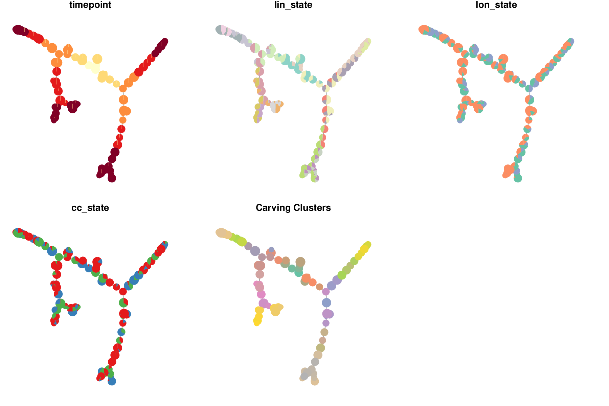</p>
<p align="center"><i>Optimal cluster-level minimum spanning tree.</i></p><br>

The gene module weights are then mapped to their constituting genes to calculate a cell-cell distance matrix from which the k-nearest neighbors graph is deduced (see next section for details).

```{r, echo = FALSE, results = "hide", message=FALSE, warning=FALSE}
pdf_to_png_to_images("/tmp/demo_carvings/carvings_SA_cell_state_graph.pdf")
```
<p align="center">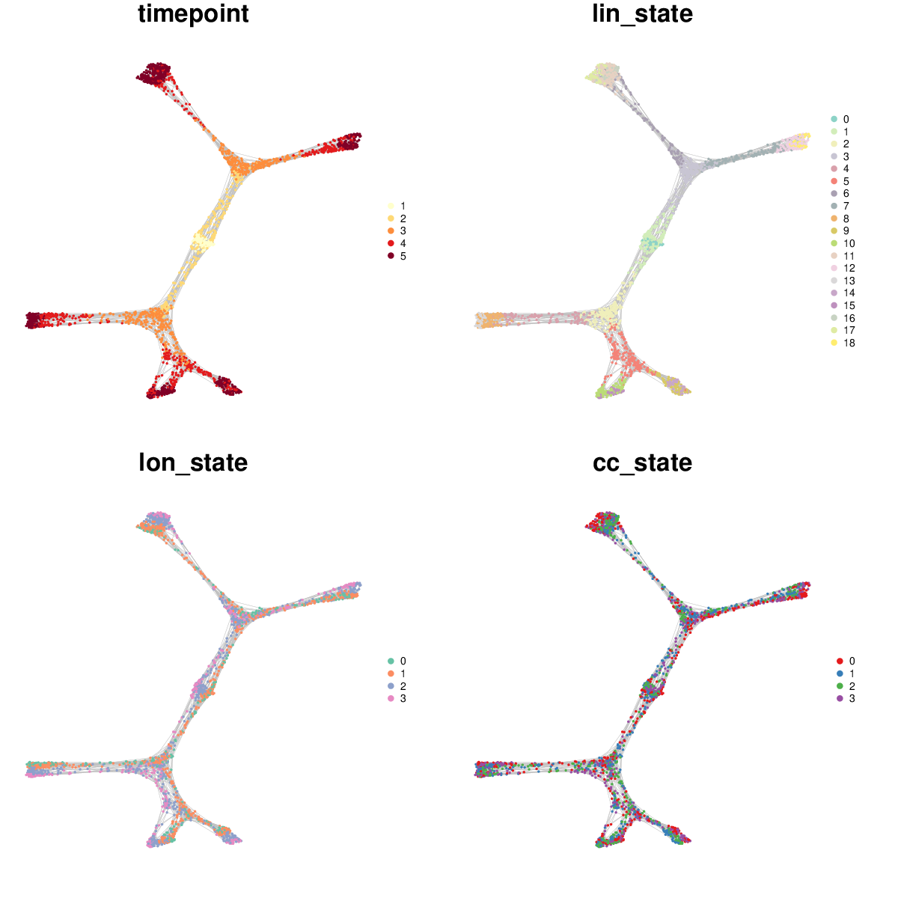</p>
<p align="center"><i>k-nearest neighbors cell state graph deduced from the optimal set of gene module weights.</i></p><br>

### Canalization

By default, the cell-cell similarity matrix from which the k-nearest neighbors graph is deduced is not solely equal to the weighted euclidean distance matrix. If the `canalize` argument is set to `TRUE`, the weighted euclidean distance matrix is divided element-wise by a diffusion kernel calculated from the optimal cMST adjacency matrix. 

This counteracts the detrimental effect of gene expression stochasticity which often brings together cells with very different transcriptomes due the spurrious expression of the same set of genes in these cells.

The diffusion kernel scales the weighted euclidean distance by increasing exponentially the distance of cells which are farther apart in the optimal cMST. This reshape the cell trajectories by guiding them along the canals formed by the optimal cMST.

[show cell cell distance, weighted cell cell distance, cMST distance/proba, canalized distance]

The only free parameter of the method is the width of kernel `kernel_sigma`, set to 1 community by default. If the width tends to infinity, the element of the diffusion kernel tend to 1, hence negating the effect of canalization. 

The influence of kernel width on the resulting cell state graph can be observed with `antler$test_kernel_widths()`.

```{r}
antler$test_kernel_widths(
  kernel_sigmas     = c(.02, .05, .05, .08, .1, .2, .5, .8, 1),
  cell_colors       = "timepoint")
```

```{r, echo = FALSE, results = "hide", message=FALSE, warning=FALSE}
pdf_to_png_to_images("/tmp/demo_carvings/candidate_kernel_params.pdf")
```
<p align="center">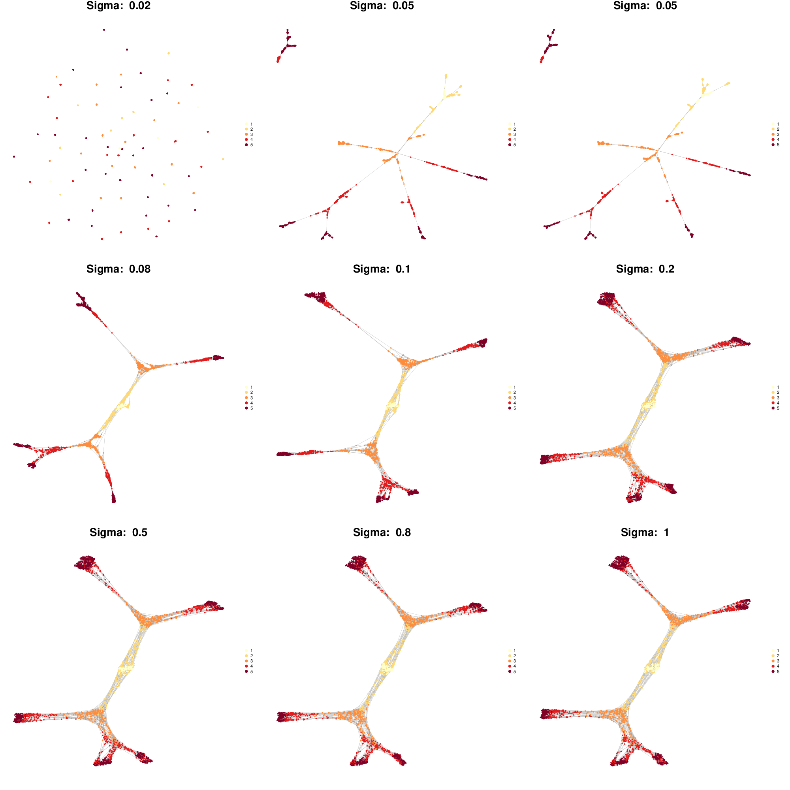</p>
<p align="center"><i>Influence of the diffusion kernel width on how the cell state graph is canalized by the optimal cMST.</i></p><br>

### Optimizing with NSGA-2

The genetic algoritm NSGA-II is a multiobjective optimization algorithm. This allows us to reduce the likelihood of converging in a local minima by maintaining a more diverse population of candidate solutions. The population is composed of individuals which are part or close to the Pareto front of the multiobjective problem.

We select two objectives in the following run: `"timecorr"` which as previously measures the correlation between sample time and cMST pseudotime, and `"complexity"` which measures the number of leaves of the cMSTs. This optimization objectives are specified by the `optim_objectives` argument.

Once the optimization terminates, the optimal solution needs to be selected from the Pareto front. 

Because it happens that multiple categories of solutions compose the Pareto front and may propose alternative venues of investigation, we cluster these solutions both at the genotypic level (gene module weights) and phenotypic level (cMST adjacency matrices). We then build solution-cluster prototypes by averaging the weights of each cluster' solutions. Prototype cMSTs are then generated for each cluster and evaluated according to the measures specified by the `GA_selection_objectives` parameter. If more than one objective is specified, the geometric mean of these measures is calculated to select the optimal solution. The weights of the optimal prototype cMST are selected and the cell state graph is built as with the simulated annealing approach above.

```{r, results = "hide", message=FALSE, warning=FALSE}
antler$carve(
  gene_modules_name          = "unbiased_gms",
  cell_colors                = c(
    'timepoint', 'lin_state', 'lon_state', 'cc_state'),
  GA_num_generations         = 200,
  GA_pop_size                = 200,
  optim_strategy             = "GA",
  optim_objectives           = c("timecorr", "complexity"),
  GA_selection_objectives    = "timecorr",
  clustering_timepoint_first = TRUE)
```

The output directory of the method contains various plots showing the progression of the population objectives as algorithms iterates. 

```{r, echo = FALSE, results = "hide", message=FALSE, warning=FALSE}
pdf_to_png_to_images("/tmp/demo_carvings/carvings_GA/Optimization_Pareto_progression.pdf")
```
<p align="center"></p>
<p align="center"><i>Progression of the Pareto front at each iteration of the genetic algoritm. The final Pareto front is show in red.</i></p><br>

### Plotting a cell state graph

The cell state graph can be rendered with the `antler$cell_state_graph$plot()` function. Different types of information can be overlayed on the graph: one of the column names of the phenotypic metadata structure (see `colnames(pData(antler$expressionSet))`), the names of a cluster entries (see `antler$cell_clusters$names()`), or one of the gene names (see `antler$gene_names()`).

```{r}
antler$cell_state_graph$plot("timepoint")
```

```{r, echo = FALSE, results = "hide", message=FALSE, warning=FALSE}
pdf_to_png_to_images("/tmp/demo_carvings/Cell_state_graph_kNN_gephiForceAtlas2_timepoint.pdf")
```
<p align="center">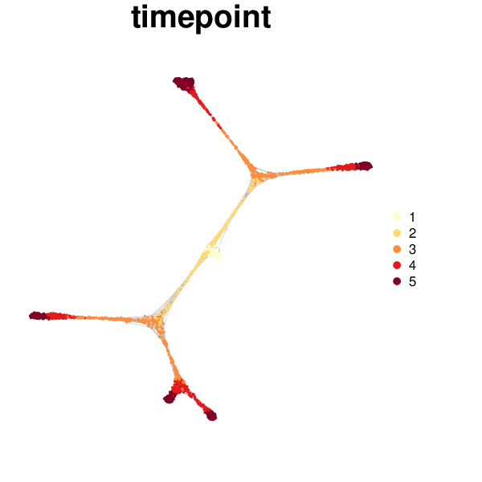</p>

Multiple types of information can be overlayed in a single plot.

```{r}
antler$cell_state_graph$plot(
  cell_colors = c(
    "Timepoint"     = "timepoint",
    "Cell clusters" = "hclust",
    "Normalized"    = "lin10g01"))
```

```{r, echo = FALSE, results = "hide", message=FALSE, warning=FALSE}
pdf_to_png_to_images("/tmp/demo_carvings/Cell_state_graph_kNN_gephiForceAtlas2_timepoint-hclust-lin10g01.pdf")
```
<p align="center"></p>

See the documentation for more details about how to use the function: `?cell_state_graph_plot`.

## Imputing gene level from cell state graph

Once a cell state graph has been built, it may be tempting to reduce the gene expression stochasticity by imputing values from neighbors. The `antler$smooth()` function performs the imputation by either:

* averaging gene expression over the cell neighbors on the cell state graph (`method` set to `average`, the size of the local neighborhood is controlled by the `depth` argument),
* diffusing the gene expression levels with a strategy similar to the one implemented in the [MAGIC](https://github.com/KrishnaswamyLab/MAGIC) package (`method` set to `diffusion`).

```{r}
antler$smooth(
  method = "average", # or "diffusion"
  from   = "Normalized",
  depth  = 2)
```

We can compare the normalized and smoothed levels of gene expression on the cell state graph.

```{r}
antler$cell_state_graph$plot(
  cell_colors = c(
    "Timepoint"  = "timepoint",
    "Normalized" = "lin10g01",
    "Smoothed"   = "lin10g01"))
```

```{r, echo = FALSE, results = "hide", message=FALSE, warning=FALSE}
pdf_to_png_to_images("/tmp/demo_carvings/Cell_state_graph_kNN_gephiForceAtlas2_timepoint-lin10g01-lin10g01.pdf")
```
<p align="center">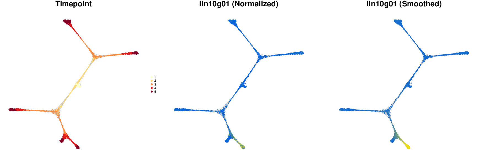</p>

We can also visualize the transcriptomic summary with the smoothed levels, to be compared with the summary produced with normalized levels above.

```{r}
antler$plot_transcriptome_summary(
  gene_modules_name  = "unbiased_gms",
  cell_clusters_name = "hclust",
  cell_side_colors   = c(
    'timepoint', 'hclust', "lin_state", "lon_state", "cc_state"),
  cell_side_colors_hide_legend = "hclust",
  gene_side_colors   = c("carver_weights"),
  data_status        = "Smoothed",
  gene_level_func    = "logscaled",
  file_settings      = list(list(type='pdf', width=12, height=10)),
  fontsize           = 6,
  color_limit_value  = 2.0,
  gene_labels        = grep("g0*[1-6]$", antler$gene_names(), value=T))
```

```{r, echo = FALSE, results = "hide", message=FALSE, warning=FALSE}
pdf_to_png_to_images("/tmp/demo_carvings/Transcriptome_summary_unbiased_gms_hclust_Smoothed_logscaled.pdf")
```
<p align="center"></p>
<p align="center"><i>Transcriptomic summary showing the smoothed gene levels. Also the gene module weights are indicated by the new set of row annotations on the left side of the heatmap.</i></p><br>

## Pseudotime dynamics

The goal of this vignette, and of all scRNA-seq lineage reconstruction tools in general, is to obtain transcriptome-wide dynamics of gene expression. Pseudotime is defined as the ordering of the cells along a tree structure originating from the earliest population of the cell state graph and progressing along branches matching the topology of the graph.

The target tree structure is very similar to the optimal cluster-level minimal spanning tree obtained by the `antler$carve()` function above yet we decide to build it from the cell state graph derived from it. This allows us to potentially identify subsidiary branches that could have been aggregated to the principal branches of the cMST when clustering the cells.

Obtaining the pseudotime dynamics with **Antler** results from two steps:

* the lineage tree is built from the cell state graph, each cell being mapped to a specific branch of the tree, with a unique pseudotime coordinate. This step is realized with `antler$build_pseudotime_tree()`.
* the pseudotemporal dynamics is obtained by smoothing the gene expression levels on trajectories starting from the tree root up to one or more tree leaves. The smoothing and plotting of the resulting dynamics are the result of `antler$plot_pseudotime_dynamics()`.

### Building the differentation tree

The lineage tree is built by calling: 

```{r, results = "hide", message=FALSE, warning=FALSE}
antler$build_pseudotime_tree()
```

This function infers the lineage tree from the cell state graph by applying the following strategy:

1. Detect the cell state graph communities which are formed by groups of densely connected cells. The method takes advantage of a [spin-glass model algorithm](https://arxiv.org/abs/cond-mat/0603718) as implemented in the [igraph](https://igraph.org/r/doc/cluster_spinglass.html) package. An advantage of this community detection method is that it does not require an a priori number of communities.
2. Define a community minimum spanning tree (comMST) based on the topology of the graph rather than the transcriptomic state of the communities. The elements of community distance matrix are the inverse of the number of cell state graph edges between pairs of communities.  
3. Identify root, intermediate and leaf communities on the comMST. 
4. Identify a unique landmark cells in each community.
5. Associate each cell to a comMST edge (or branch). 
6. Define the cell pseudotime coordinate by interpolating between the associated comMST edge landmarks' sample time.

A fundamental principle of the method is that the pseudotime tree structure is reconstructed in the topological space of the graph, and not in a projected space akin to the one used to visualize the graph (e.g. see below).

```{r, echo = FALSE, results = "hide"}
pdf_to_png_to_images("/tmp/demo_carvings/PT_tree_cell_state_graph_landmarks.pdf")
pdf_to_png_to_images("/tmp/demo_carvings/PT_tree_cell_state_graph_pt.pdf")
pdf_to_png_to_images("/tmp/demo_carvings/PT_tree_communities.pdf")
pdf_to_png_to_images("/tmp/demo_carvings/PT_tree_pt.pdf")
```

<p align="center">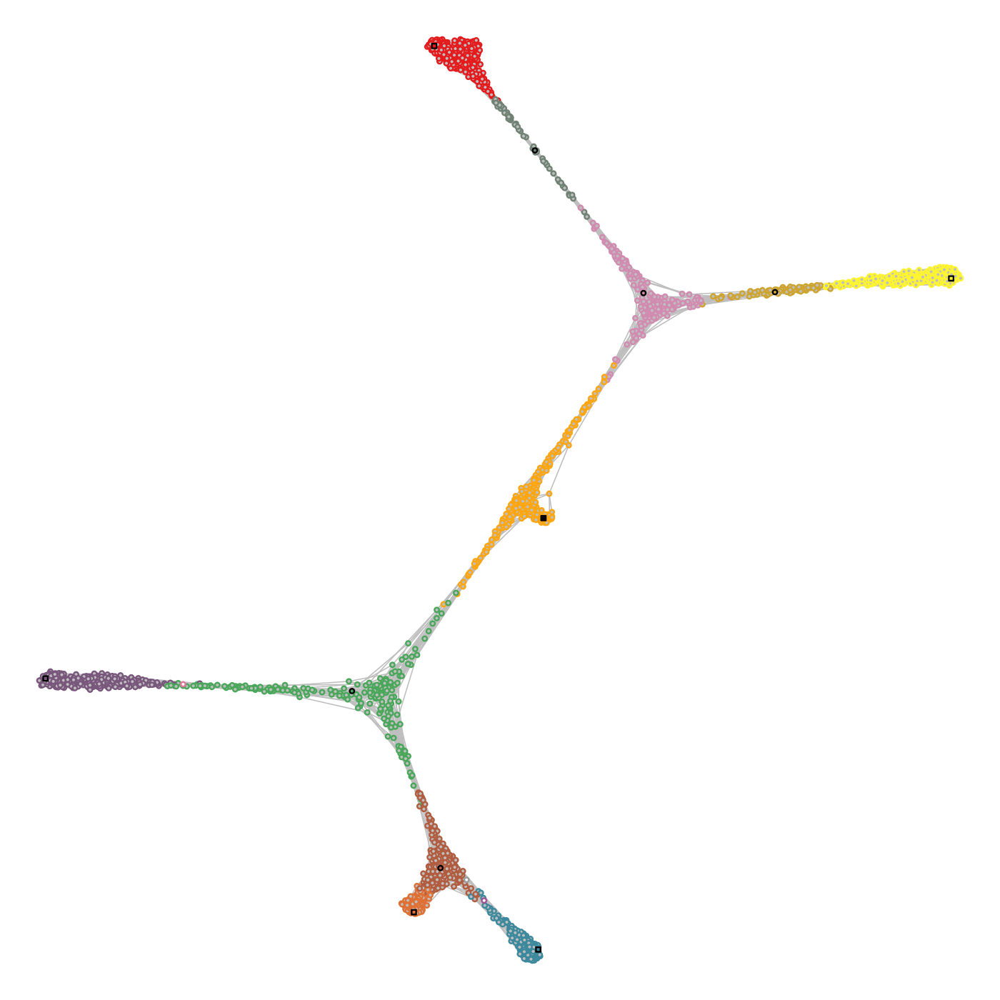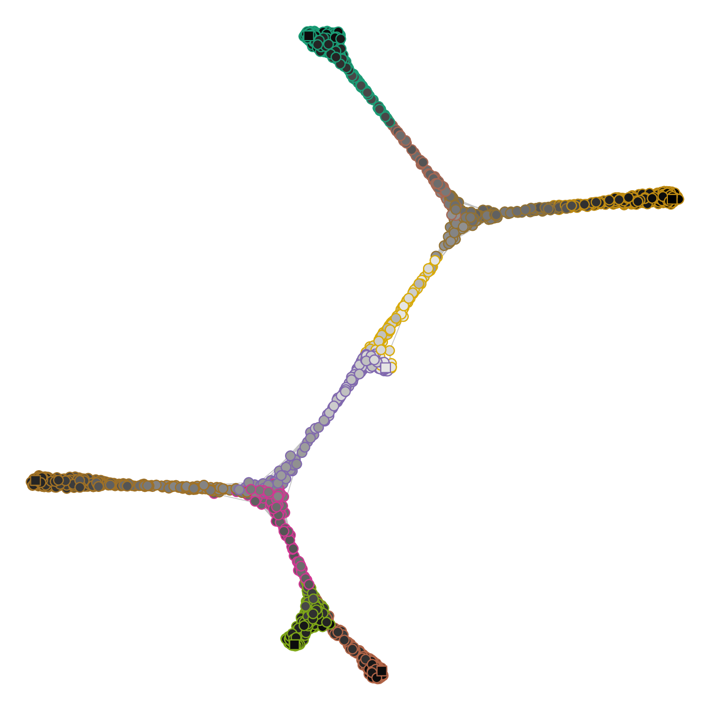</p>
<p align="center"><i>Cell state graph annotated with the structure used to build the lineage tree. (Left) Colors indicate the cell community, black circles the intermediate landmarks, black squares the leaf landarks and the filled black square the root landmark of the graph. (Right) Each cell is mapped to an edge of the comMST, indicated by the circle border colors. The greyscale colors of the circles indicate the progression on the pseudotime axis.</i></p><br>

Plotting the comMST offers a cleaner representation of the lineage tree.

<p align="center">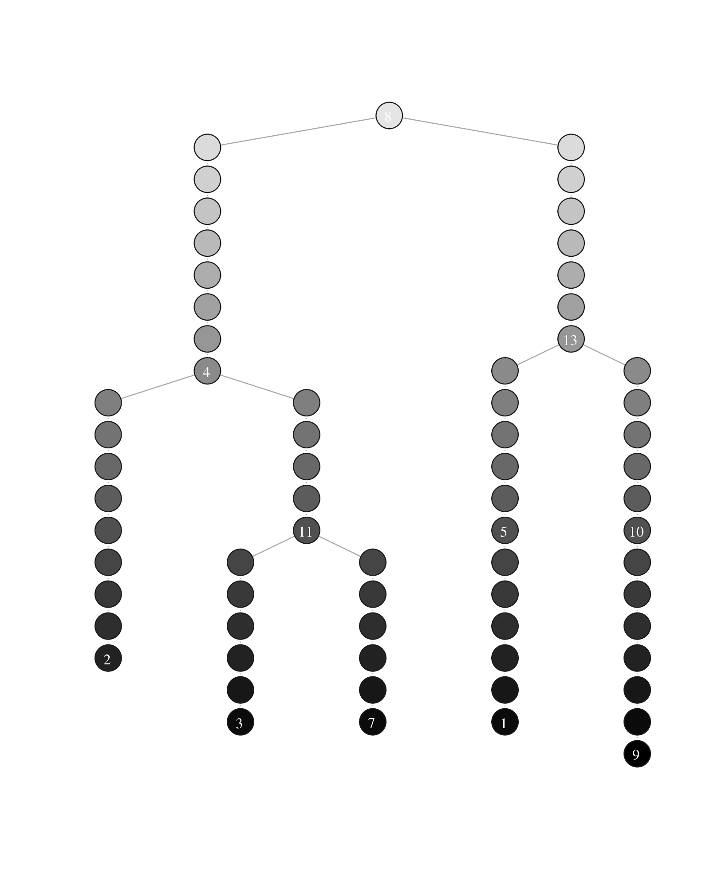</p>
<p align="center"><i>Lineage tree visualization of the trajectories. The circle colors represent the communities (left) and the pseudotimepoints (right). The numbered circle indicates community landmarks, the number of pseudotimepoints separating two consecutive communities is proportional to the diameter of the subgraph composed of all cells of a branch (i.e. a comMST edge).</i></p><br>

### Plotting pseudotime dynamics

Pseudotime dynamics are obtained by averaging the expression levels of the cells associated with the same pseudotime coordinate on the lineage tree. The dynamics are then smoothed using a polynomial regression fitting function. The standard deviation of the expression levels is also calculated for all coordinates.

Plotting the pseudotime dynamics requires to select one or more gene names to be rendered and the indices of the trajectories along which the pseudotime is calculated. A trajectory index is defined as the index of the leaf community of that trajectory as displayed on the lineage tree plots above.

```{r, results = "hide", message=FALSE, warning=FALSE}
antler$plot_pseudotime_dynamics(
  gene_list   = "lin09g01",
  leaf_ids    = c(2, 3, 7),
  show_cells  = TRUE,
  data_status = "Normalized")
```

```{r, echo = FALSE, results = "hide"}
pdf_to_png_to_images("/tmp/demo_carvings/PT_dynamics_lin09g01_Normalized.pdf")
```

<p align="center">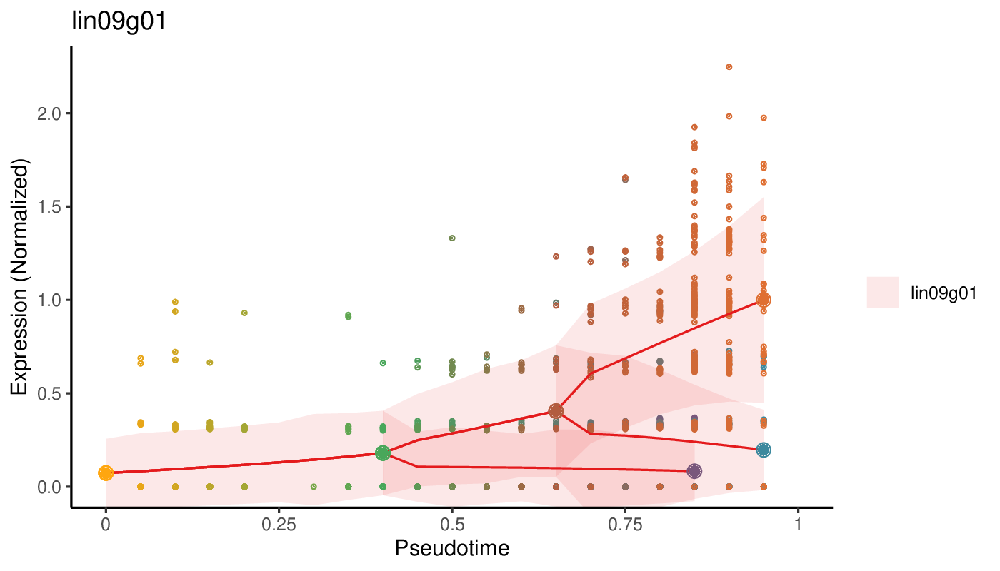</p>
<p align="center"><i>Pseudotime dynamics of a gene. The solid red line indicates the pseudotime dynamics along which the larger dots represent the landmark of the trajectories, using the same color code as for the lineage tree and cell state graph plots. The smaller dots show the normalized level of expression of each individual cell. The ribbons surrounding the solid line indicates the standard deviation of the dynamics.</i></p><br>
