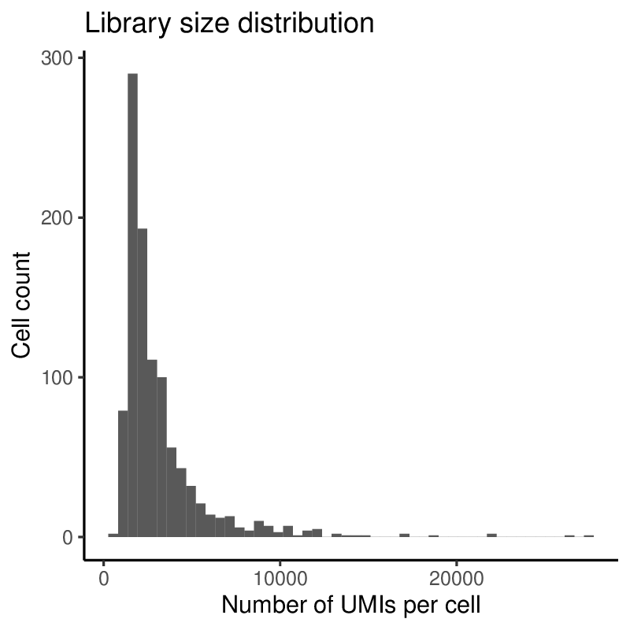
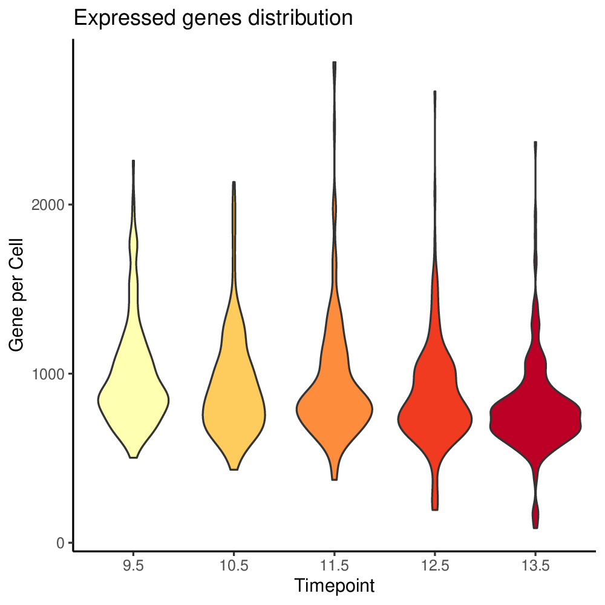
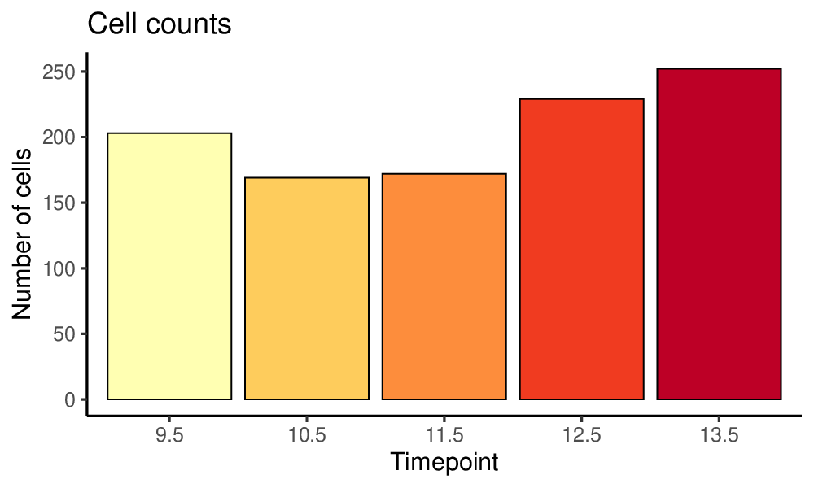
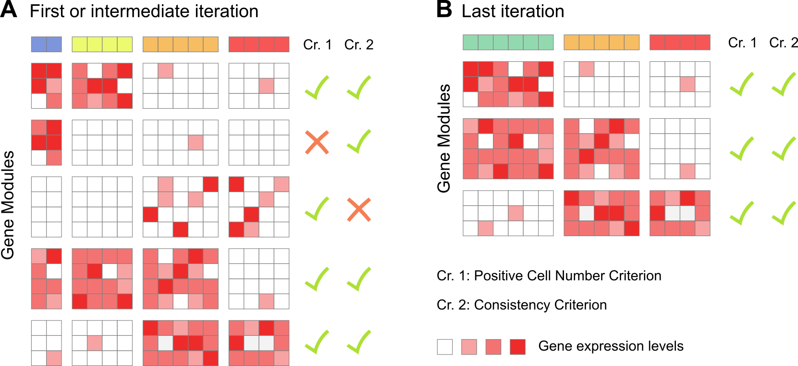
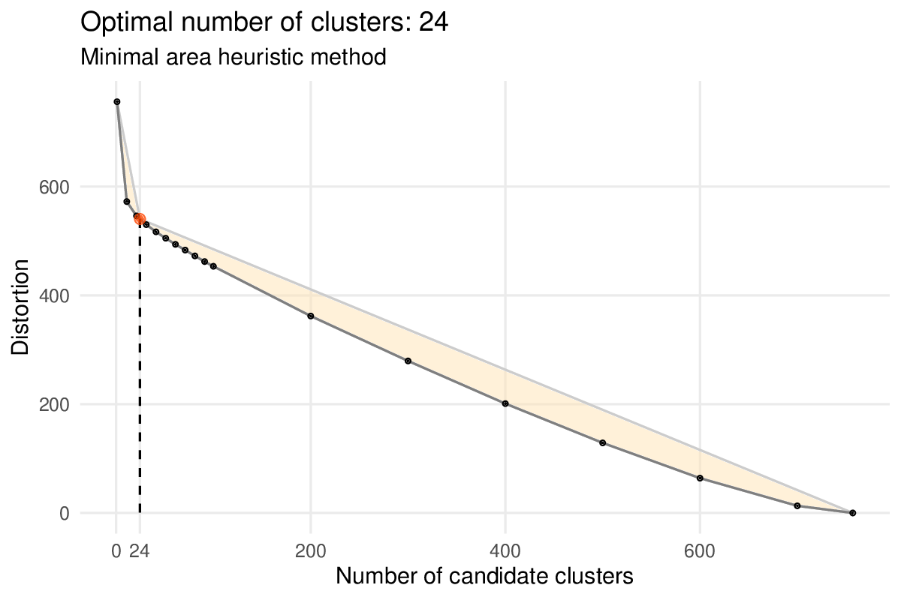
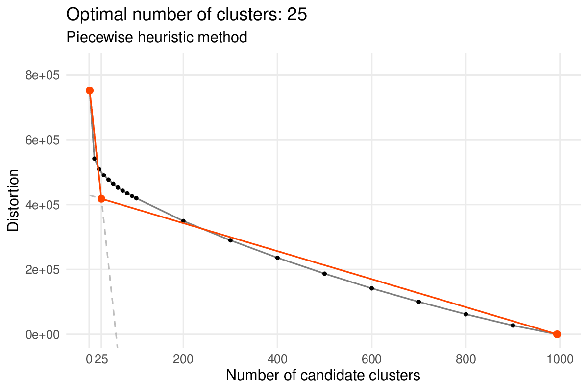

```{r, echo = FALSE}
embed_png <- function(path, dpi = NULL) {
  meta <- attr(png::readPNG(path, native = TRUE, info = TRUE), "info")
  if (!is.null(dpi)) meta$dpi <- rep(dpi, 2)
  knitr::asis_output(paste0(
    ""
  ))
}
pdf_to_png <- function(pdf_file) {
	if (.Platform$OS.type == "unix") {
		system2(
			command = "convert",
			args = paste(
				"-density 200",
				pdf_file,
				sub("\\.pdf", "\\.png", pdf_file)))
	} else {
		stop("Vignette generated only on unix. Todo: add command for windows if needed.")
	}
}
pdf_to_png_to_images <- function(pdf_file) {
  pdf_to_png(pdf_file)
  file.copy(sub("\\.pdf", "\\.png", pdf_file), "./images/")
}
knitr::opts_chunk$set(comment = "#>", collapse = TRUE)
# knitr::opts_chunk$set(eval=FALSE)
```

```{r results="asis", echo=FALSE}
# directly adding css to output html without ruining css style https://stackoverflow.com/questions/29291633/adding-custom-css-tags-to-an-rmarkdown-html-document
cat("<style> img {border: 0px;outline: 0;padding: 10px;}</style>")
```

In this vignette, we will demonstrate how **Antler** can be used to identify, export and visualize the transcriptomic states of the cells present in a single-cell RNA-seq (*scRNA-seq*) dataset.

<p align="center"></p>
<p align="center"><i>Example of a transcriptomic summary produced in this vignette.</i></p><br>

A typical **Antler** pipeline is data-driven and as unbiased as possible. It requires little knowledge about the biological context of the dataset. The workflow consists in the following steps:

1. Loading and preparing the dataset
2. Pre-processing
    * Removing outlier gene and cells
    * Normalizing gene expression levels
3. Identifying gene modules
4. Defining cell transciptomic state
5. Visualizing
6. Redefining cell states with prior knowledge if needed

Among these steps, the most important one is the gene module identification step which selects and groups all the genes defining the data-driven transcriptomic states.

In contrast with other scRNA-seq analysis methods, **Antler** performs a direct gene selection from the raw or normalized gene expression levels using correlation. It does not rely on preliminary linear or non-linear dimension reduction steps to retain the signal of interest. The main advantage is that the characterization the cell states is transparent, we known which genes contribute to the states definition.

Once the data-driven transcriptomic states are defined, the user has two options to refine this unbiased description and reveal the context-dependent cellular states:

* either selecting manually the modules containing known genes involved in the biological context and new candidate ones hence defining context-dependent transcriptomic states,

* or taking advantage of the `carve()` function which select automatically the gene modules related to time-dependent differentiation and build graph-based trajectories (see) the "Carving cell trajectories" vignette).

## Creating an Antler object

After attaching the **Antler** package to the R session, we instanciate an single object which will contain both the data and all the functions provided by the package (a R "reference class"). The `output_folder` argument specifies the location of folder containing the different plot and reporting files generated during the analysis.

```{r, message = FALSE}
library(Antler)
```

```{r}
antler <- Antler$new(output_folder="/tmp/demo_antler/")
```

The functions are called using the name of the instanciated object (here `antler`) and the `$` operator. For example the dataset is loaded by calling the following function (see below): `antler$load_dataset()`.

The documentation of a function is accessed with the standard `help()` function and `?` help operator, and without writing the name of the instanciated object. To get the documentation of the `antler$load_dataset()` function, type `?load_dataset`.

## Loading the data

In this vignette, we will analyse a small dataset included in the package comprising 1025 cells dissected from the cervicothoracic region of developing mouse embryos. The full dataset can be retrieved by following these [external instructions](https://github.com/juliendelile/MouseSpinalCordAtlas#data-availability).

By default, the dataset folder must contain two tab-delimited csv files:

* A read count file named "assayData.csv" with cell names in the header and gene names as row names,
* A meta-data file named "phenoData.csv" and populated with at least 3 fields: "timepoint" (floating values), "replicate_id" (integer values) and "treatment" (characters).

Fo now we will locate and load the files provided by the package using the `system.file` function as the dataset folder path depends on the package installation path. In general, a simple character path is used.

```{r}
antler$load_dataset(
  folder_path = system.file(
    "extdata",
    "mouse_spinal_cord",
    package = "Antler"))
```

Read counts and cell meta-data can also be specified with different file names (`phenoData_filename` and `assayData_filename` arguments) or directly from matrices (`assayData` and `phenoData`).

`num_cells()` and `num_genes()` are the functions counting the number of cells and genes stored in the dataset.

```{r}
antler$num_cells()
```

```{r}
antler$num_genes()
```

## Preparing the data

ScRNA-seq datasets are generally produced by sequencing platform identifying genes by their *ensembl* id. For conveniency, we replace these ids with the associated gene names by running the `convert_ensembl_id_to_name()` function:

```{r, eval = FALSE}
antler$convert_ensembl_id_to_name(biomart_dataset = "mmusculus_gene_ensembl")
```

The first 20 gene names can be viewed with:

```{r, eval = FALSE}
antler$gene_names()[1:20]
```

For reproducibility, speed or in absence of internet connection the ensembl id conversion can be processed from a local mapping csv file. A copy of the mouse and chick gene names is provided in the package. These files may need updating as names keep on getting created or redefined.

```{r}
antler$convert_ensembl_id_to_name(
	biomart_dataset = "mmusculus_gene_ensembl",
	gene_ids_mapping_file = system.file(
		"extdata",
		"Annotations/biomart_ensemblid_genename_mmusculus.csv",
	package="Antler"))
```

Optionally, we may also want for aesthetic reasons to map specific colors to some cell or gene features. In the following, we will generate plots decorated by the cells' `'timepoint'` and `'replicate_id'` features. These colors can be specified as the following:

```{r}
antler$add_color_map(
  name = "timepoint",
  content = setNames(
    RColorBrewer::brewer.pal(5,"YlOrRd"),
    c("9.5", "10.5", "11.5", "12.5", "13.5")))

antler$add_color_map(
  name = "replicate_id",
  content = setNames(
    RColorBrewer::brewer.pal(3,"PuBu"),
    c(1, 2, 3)))
```

The list of loaded color maps can be accessed with `antler$color_maps`.

## Pre-processing

**Antler** proposes a minimal set of pre-processing functions aiming at removing outlier genes and cells and normalizing the gene levels. We consider that more complex pre-processing such as identifying batch-dependent genes can be done with the gene module identification strategy that will be introduced in the next section.

### Visualizing gene levels and cell count distributions

To set filtering thresholds and exclude outlier cells and genes, it is recommended to first visualize the distributions of gene levels and cell counts with `antler$plot_QC()`. The following plotting function generates pdf files in the project output folder specified when creating the `antler` object.

```{r}
antler$plot_QC(
  data_status = "Raw",
  feature_1   = "timepoint",
  reads_type  = "UMI")
```

The `antler` object stores up to three versions of the gene levels:

* the `"Raw"` level corresponding to the exported sequencing values. This is the default status for the loaded dataset.
* the `"Normalized"` level corresponding to normalized values (see below).
* the `"Smoothed"` level corresponding to imputed levels using the cell state graphs (see [vignette](https://juliendelile.github.io/Antler/articles/Carving-cell-trajectories.html#imputing-gene-level-from-cell-state-graph-1)).

In the previous function call, we specified `data_status = "Raw"` to use the raw gene level in the distribution plots. 

The generated plots are slightly redundant in order to satisfy a wider range of user preferences.

```{r, echo = FALSE, results = "hide"}
pdf_to_png_to_images("/tmp/demo_antler/library_sizes.pdf")
pdf_to_png_to_images("/tmp/demo_antler/expressed_genes_per_cell.pdf")
pdf_to_png_to_images("/tmp/demo_antler/library_sizes_I_by_timepoint.pdf")
pdf_to_png_to_images("/tmp/demo_antler/cell_count_by_timepoint.pdf")
pdf_to_png_to_images("/tmp/demo_antler/expressed_genes_count_by_timepoint.pdf")
pdf_to_png_to_images("/tmp/demo_antler/library_sizes_II_by_timepoint.pdf")
```

<p align="center"></p>

<p align="center"></p>

<p align="center"><i>Plots generated by `antler$plot_QC()`<br>(Note that the colors are taken from the `timepoint` color map specified above).</i></p><br>

More advanced plots can also be generated by specifying another grouping feature via the `feature_2` argument (e.g. try `feature_2 = "replicate_id")`.

### Remove outlier genes and cells

A cell will be excluded if it does not satisfy all the following 3 criteria:

* minimum total read (or UMI) counts (default to `-Inf`).
* maximum total read (or UMI) counts (default to `Inf`).
* minimum number of expressed genes (default to `1000`).

A gene will be excluded if the number of cells it is expressed in is lower than a threshold value (default to `10`).

Upon inspection of the above expressed genes distribution, we will simply select cells having at list 500 UMIs instead of the default threshold of 10.

```{r}
antler$remove_outliers(
	min_genes = 500,
	min_cells = 20)
```

### Normalization

Three methods are implemented to normalize the raw gene expression level:

* `'CPM'` or `'Count-Per-Million'`: the raw gene expression levels are divided by the total read count of the cell and multiplied by 1e6. This method corrects for sequencing depth.

* 'FPKM': the CPM levels are divided by the gene length in kilobase. This method corrects for sequencing depth and gene length.

* `MR` or `'Median-of-ratios'`: the raw gene expression levels are divided by cell size factors equals to the median ratio of gene counts relative to geometric mean per gene. This method corrects for library size and RNA composition bias and is a reimplementation of DESeq2' [`estimateSizeFactors()`](https://rdrr.io/bioc/DESeq2/man/estimateSizeFactors.html) with the "poscounts" estimator which deals with genes with some zeros.

We will now use the latter method.

```{r}
antler$normalize(method = 'MR')
```

### Gene selection from dispersion

Because the cell states will be characterized by genes showing variable expression in the dataset and to reduce the computational workload of the pipeline, it is suggested that another preliminary gene-filtering step is applied. We use the measure of dispersion by bins introduced in [Satija et al. 2015](https://dx.doi.org/10.1038%2Fnbt.3192) and implemented in the [Seurat](https://rdrr.io/cran/Seurat/man/FindVariableFeatures.html) package to select genes having a sufficient (z-)score.

Here the dispersion (z-)scores are calculated on the normalized expression levels, as specified by the `data_status` argument.

```{r}
antler$select_dispersed_genes(
	zscore_threshold = -.5,
	data_status      = "Normalized")
```

## Gene Modules Identification

One of the most useful methods in **Antler** is the gene module identification step which clusters genes demonstrating concerted patterns of expression using correlation.

The gene modules reveal all the transcriptomic features in the cell population of the dataset. This list is unbiased and is often too exhaustive to characterize a specific biological question. We obtain gene modules highlighting features related to cell cycle, metabolism or even set of genes related to the way the samples are produced (batch effect). We will see in a section [further below](#redefining-cell-states-with-prior-knowledge) how to restrict the gene modules to a specific context.

At its core, gene module identification is an iterative method which defines gene modules by clustering and applies a set of quality control filters to each of the modules. Iteration stops when all the gene modules satisfy the filtering criteria. The associated function is `antler$gene_modules$identify()`.

<p align="center"></p>
<p align="center"><i>Intermediate and final iterations of the gene module identification method. A. Among the 5 gene modules identified, 2 do not satisfy some quality control criteria (see below). These genes are excluded and the remaining ones are re-clustered until B. all gene modules are compliant.</i></p><br>

Prior to the iterative loop, the genes showing highest Spearman correlation with a least `corr_min` other genes are selected. Either a minimal correlation threshold (`corr_t`) or a target number of genes to select ('corr_num_genes') must be specified. Using Spearman correlation offers two advantages: it does not require specific types of distribution for each pair of genes and is robust to outliers.

Once the first set of genes have been selected, the iterative process is triggered with each loop starting by grouping the genes into modules using a hierarchical clustering algorithm. For the same reasons as above, we work with the Spearman correlation as a measure of gene dissimilarity. By default, a heuristic method is used to determine the optimal number of modules.

```{r, echo = FALSE, results = "hide", message=FALSE, warning=FALSE}
antler$gene_modules$identify(
  name                  = "unbiasedGMs",
  corr_t                = 0.3,  # the Spearman correlation treshold
  corr_min              = 3,    # min. number of genes a gene must correlate with
  mod_min_cell          = 10,   # min. number of cells expressing the module
  mod_consistency_thres = 0.3,  # ratio of expressed genes among "positive" cells
  process_plots         = TRUE) # plot optimal module number heuristics

pdf_to_png_to_images("/tmp/demo_antler/Gene_module_identification_unbiasedGMs_heuristic_loop_0.pdf")
```
<p align="center"></p>
<p align="center"><i>Heuristic method selecting an "optimal" number of gene modules (or "clusters" in figure). Module distortions (sum of squared differences between a gene and its module average) are calculated for different number of modules: 1, 11, 21, .., 91, 100, 200, ..., 700 and 757, the number of remaining genes (black dots). The method defines the position of the "elbow" of the curve as the point minimizing the area of the orange polygon (red dot).</i></p><br>

This heuristic can be overriden by giving a specific target number with the `num_final_gms` argument.

We then employ a set of 5 criteria aiming at discarding any modules comprising genes showing more noise than signal:

1. A first filtering criterion is applied to test whether enough cells are expressing the genes that comprise the gene module. For each cell, we obtain an average expression level per module by averaging the z-scored log-transformed normalized expression levels of all genes that belong to the module. These gene module averaged levels are then binarised independently using a parameter-free adaptive thresholding method. A cell is considered to "express" a gene module if the associated Boolean value is true. Modules expressed in fewer than `mod_min_cell` cells are excluded (default to `0`). A maximum number of cells expressing a gene module can also be specified (`mod_max_cell` which defaults to `Inf`).

2. A second filtering criterion is applied to test whether cells are expressing the gene module with consistently high levels over most of the genes in the module. We once again binarise the z-scored log-transformed normalized expression levels of all the remaining genes independently. Then, for each module, we calculate the ratio of Boolean values in cells that expressed the module (as defined in 1). We exclude modules in which less than `mod_consistency_thres` of these Boolean values were true (default to `0.4`).

3. A third filtering criterion is a variation of the second one where the average expression level in cells expressing the module must be higher than a minimum threshold `min_cell_level` (default to `0`).

4. A fourth filtering criterion is applied to test whether genes are expressed only in a subset of the cells. We select modules having an average level skewness higher than `mod_skewness_thres` (default to `-Inf`).

5. Optionally, a fifth filtering criterion can be applied to select modules demonstrating a sufficient correlation with an external cell metadata (e.g. the sample time point or a combination of specific genes).

In most use cases, as in this vignette, only the first two criteria are needed.

Importantly this method requires that the gene levels have been normalized before being run so it will throw an error if it has not been done.

```{r, eval = FALSE}
antler$gene_modules$identify(
	name                  = "unbiasedGMs",
	corr_t                = 0.3,  # the Spearman correlation treshold
	corr_min              = 3,    # min. number of genes a gene must correlate with
	mod_min_cell          = 10,   # min. number of cells expressing the module
	mod_consistency_thres = 0.3,  # ratio of expressed genes among "positive" cells
	process_plots         = TRUE) # plot optimal module number heuristics
```

Multiple set of gene modules can be identified under different settings so each time a different `name` argument must be specified. The set of curently available lists of gene modules is obtained with:

```{r}
antler$gene_modules$names()
```

A specific set of gene modules can be printed with:

```{r, eval = FALSE}
antler$gene_modules$get("unbiasedGMs")
```

Users can also provide their own gene modules manually, given that the gene names are present in the dataset (see `antler$gene_names()` to retrieve the list):

```{r}
antler$gene_modules$set(
  name    = "manual",
  content = list(c("Tubb3", "Sox21"), c("Lhx1", "Sox1")))
```

It must be noted that the syntax of this function call is slightly different from the previous ones and involves two `$` symbols. This is because the `gene_modules` field of `antler` is itself a reference class having its own `identify()` function. A downside is that the function documentation is accessed with a slightly different pattern: `?gene_modules_identify` for example.

## Unbiased and Comprehensive Transcriptomic States

In this section we aim at defining the comprehensive set of unbiased transcriptomic cell states. These states are "unbiased" because no prior biological knowledge is needed to define them and "comprehensive" because all the transcriptomic features identified above will be used. Later below, we will see how to subset the gene modules using prior knowledge.

The process of defining the transcriptomic states presents two challenges inherent to clustering problems:

1. what clustering algorithm should be used?
2. how many states or clusters coexist in the dataset?

Once again, we utilize a hierarchical clustering algorithm, mainly for the sake of visualization. Indeed, once the cell states have been defined, the recommended next step is to visualize them as a heatmap (see next section). In contrast to most clustering algorithm, hierarchical clustering orders all the cells independently from the number of clusters. This allow us to visually evaluate the need to increase or decrease the number of identified states by observing whether some states could be divided further.

Without specifying a target number of clusters with the `num_clusters` argument, the `antler$cell_clusters$identify()` function determines an optimal number of clusters with a second heuristic method. Similarly to the gene module heuristic method, the cell cluster one also aims at defining the position of the elbow of the distortion curve but it predicts an optimal number which tends to be lower.

```{r}
antler$cell_clusters$identify(
  name              = "hclust",
  gene_modules_name = "unbiasedGMs",
  # num_clusters      = 20, # uncomment to obtain 20 clusters
  process_plots     = TRUE)
```

With the current dataset we obtain `r antler$cell_clusters$get("hclust")$num_clusters` cell states with the heuristic method.

```{r, echo = FALSE, results = "hide", message=FALSE, warning=FALSE}
pdf_to_png_to_images("/tmp/demo_antler/Cell_clustering_heuristic_hclust.pdf")
```
<p align="center"></p>
<p align="center"><i>Heuristic method selecting an "optimal" number of cell clusters.</i></p><br>
<p align="center"><i>Heuristic method selecting an "optimal" number of cell clusters. The method estimates the position of the "elbow" of the curve by fitting a piecewise linear function to the distortion curve. The fitted function is anchored on the two distortion curve extrema and the position of the central endpoint is optimized by least-square regression. The absissa of that point is the estimated number of clusters.</i></p><br>

## Visualizing the comprehensive summary of the transcriptomic states

The primary objective of this vignette is to produce a single plot highligthing all the important transcriptomic features of a scRNA-seq dataset. This plot is generated by the `antler$plot_transcriptome_summary()` function. It consists in a usually large heatmap showing all the selected genes horizontally and the cell clusters vertically. Among other advantages, a careful inspection of the transcriptomic summary heatmap facilitates:

* the discovery of new candidate genes,
* the evaluation of the sizes of the different cell states,
* the selection of specific cell populations for further analysis.

Before calling the plotting function, we are taking advantage of the `genes_from_GOterms()` function to build a list of domain-relevant genes from a list of [GO terms](http://geneontology.org/docs/ontology-documentation/). While it is possible not to, it is advised to restrict the set of displayed gene names in the plot for clarity. This is especially true if the gene modules comprise a large number of genes (here a reasonable total of `r length(unlist(antler$gene_modules$get("unbiasedGMs")))` genes). The current dataset being mostly made of neural cells in a forming spinal chord, we use the following GO terms to build our list of gene names:

* `GO:0007399` for genes associated with nervous system development,
* `GO:0030154` for genes associated with cell differentiation,
* `GO:0016477` for genes associated with cell migration.

```{r}
gene_list <- genes_from_GOterms(c('GO:0007399', 'GO:0030154', 'GO:0016477'))
```

We finally call the `antler$plot_transcriptome_summary()` plotting function. Here will generate a single pdf file in the project `output_folder` directory but more files can be generated at once by uncommenting the commented lines.

```{r}
antler$plot_transcriptome_summary(
  gene_modules_name  = "unbiasedGMs", # name of the set of gene modules
  cell_clusters_name = "hclust",      # name of the cell clusters as defined above
  cell_side_colors   = c('timepoint', 'replicate_id', 'hclust'),
  data_status        = "Normalized",
  gene_level_func    = "logscaled",
  file_settings      = list(
  	list(type='pdf', width=12, height=8)
  	# , list(type='cairo_pdf', width=12, height=8) # better choice for large heatmaps
  	# , list(type='png', width=2400, height=1600, res = 200) # png output
  	),
  fontsize           = 6,
  color_limit_value  = 2.0,
  gene_labels_filter = gene_list)
```

The resulting heatmap looks as the following:

```{r, echo = FALSE, results = "hide", message=FALSE, warning=FALSE}
pdf_to_png_to_images("/tmp/demo_antler/Transcriptome_summary_unbiasedGMs_hclust_Normalized_logscaled.pdf")
```
<p align="center"></p>
<p align="center"><i>Heatmap of the comprehensive transcriptomic summary of the dataset.</i></p><br>

If the above pipeline is run on the whole 40k+ cells dataset, the transcriptomic summary heatmap reveals the variety of transcriptomic features and cell populations to a much greater extend.

<p align="center"></p>
<p align="center"><i>Heatmap of the comprehensive transcriptomic summary of the full 40k+ cells dataset.</i></p><br>

### Plotting tips

The heatmap is easier to read when maximized fullscreen on a monitor. A few parameters can be tuned to improve the final appearance of the plot: the width, height and resolution (png files only) are controlled by `file_settings`, the number of printed genes per line is controlled by `num_gene_per_line` (defaults to 8), the base font size by `fontsize` (defaults to 10), the range of the expression level color map by `color_limit_value` (defaults to 2 for z-normalized log-transformed levels as specified above). More arguments of the underlying plotting function `pheatmap::pheatmap()` can also be tuned such as `treeheight_col` setting the height of the dendrogram, `cellheight` for each individual matrix element height,`legend` to show the legend, `annotation_legend` to show the annotation legend... etc. (see `?pheatmap` for more information).

### Large dataset

For large datasets (i.e. between \~10k and \~100k cells), the only plotting backend producing consistent outputs is `cairo_pdf`. It generates a normal text-searchable pdf file replacing vector-based graphics with bitmaps (sometimes). If the output pdf file is too large to be opened with a standard pdf viewer, one option is to convert it to a png file manually, for example using [ImageMagick](https://imagemagick.org/index.php) (see the `pdf_to_png()` function in this vignette's source).

For very large dataset (i.e. with 100k+ cells), the most challenging step of the pipeline will be the cell clustering one which relies on a square dissimilarity matrix with as many row as cells. If that hurdle is passed over, the transcriptomic summary plots can be generated with only a subset of the cells by using the `subsampling_ratio` and `subsampling_min_cells` arguments.

## Redefining cell states with prior knowledge

While the comprehensive transcriptomic summaries offer a complete representation of the cell states at the RNA level, a typical biological study is primarily interested in a subset of the transcriptomic features: those containing genes that have already been characterized.

Selecting the features of interest can be achieved in two ways:

* by specifying the indices of the selected gene modules,

```{r}
antler$gene_modules$select_from_ids(
  name_to   = "selection_I",
  name_from = "unbiasedGMs",
  ids       = c(3, 5, 15:21, 23:24))
```

* by extracting the gene module containing a list of target gene names.

```{r}
antler$gene_modules$select_from_gene_names(
  name_to    = "selection_II",
  name_from  = "unbiasedGMs",
  gene_names = c("Tubb3", "Lhx1", "Wnt6", "Sox1", "Sox21"))
```

These two methods can be combined sequentially.

The characterization of the transcriptomic cell states is subjected to the selection of gene modules. The comprehensive and unbiased transcriptomic summary is often too dense to be practical and includes factors which are independent from the question of interest. By chosing to ignore some transcriptomic features and favor others, we are able to redefine the cell states, guided by existing biological knowledge.

We calculate and visualize this new set of cell clusters using the same function as previously.

```{r}
antler$cell_clusters$identify(
  name              = "hclust_selection_I",
  gene_modules_name = "selection_I",
  num_clusters      = 20)

antler$plot_transcriptome_summary(
  gene_modules_name  = "selection_I",
  cell_clusters_name = "hclust_selection_I",
  cell_side_colors   = c('timepoint', 'replicate_id', 'hclust_selection_I'),
  cell_side_colors_hide_legend = "hclust_selection_I",
  data_status        = "Normalized",
  gene_level_func    = "logscaled",
  file_settings      = list(list(type='pdf', width=12, height=7)),
  color_limit_value  = 2.0,
  gene_labels_filter = gene_list)
```

```{r, echo = FALSE, results = "hide", message=FALSE, warning=FALSE}
pdf_to_png_to_images("/tmp/demo_antler/Transcriptome_summary_selection_I_hclust_selection_I_Normalized_logscaled.pdf")
```
<p align="center"></p>
<p align="center"><i>Heatmap of a transcriptomic summary guided by prior knowledge.</i></p><br>

## Dissecting cell population *in silico*

Dissecting tissues *in vivo* or selecting for specific cell population *in vitro* often lead to the contamination of the samples with unsought cells. The advent of large scale datasets alleviates this concern and allow the *in silico* dissection of the dataset.

There are two ways to remove cells from an **Antler** pipeline:

* by specifying the excluded cell ids,

```{r, eval = FALSE}
antler$remove_cells(ids = seq(100)) # remove the first 100 cells
```

* and more conveniently by specifying the index of a cell cluster.

```{r, eval = FALSE}
antler$remove_clusters(
  cell_clusters_name = "hclust_selection_I",
  ids                = c(1, 6)) # remove clusters #1 and #6
```

This operation is definitive, cells can not be recovered after being excluded. It is sometimes convenient to make of copy of the `antler` object and work of the copy to keep the original object intact:

```{r}
antler_subset <- antler$copy()
antler_subset$remove_cells(ids = seq(100))
```

Once a set of cells are excluded, it is recommended to re-run the pipeline on the subsetted object. New gene modules will be different as the correlation won't be calculated on the excluded cells and new cell clusters should be deduced.

## Exploring the gene modules

When a set of genes is expected to come up in the identified gene modules, it can be cumbersome to go through lists with hundreds of genes. We provide a function to facilitate this process.

```{r}
antler$gene_modules$report_genes(
  name       = "unbiasedGMs",
  gene_names = c("fake_gene", "Ass1", "Lhx1", "Wnt6", "Sox1", "Sox21"))
```

## Exporting

As an **Antler** project is contained in a single object, it is easy to save it for later use...

```{r, eval = FALSE}
saveRDS(antler, file = "/tmp/antler.rds")
```

...and to load it in a fresh session.

```{r, eval = FALSE}
library(Antler)
antler = readRDS(file = "/tmp/antler.rds")
```

Different options are available to export parts of a project:

* Exporting a gene module to a text file:

```{r, eval = FALSE}
antler$gene_modules$export("unbiasedGMs")
```

* Exporting the gene expression matrix and the cell metadatas (including the cluster indices):

```{r, eval = FALSE}
antler$save_dataset(
  folder_path = "/tmp/exported_dataset/",
  data_status = "Raw")
```
